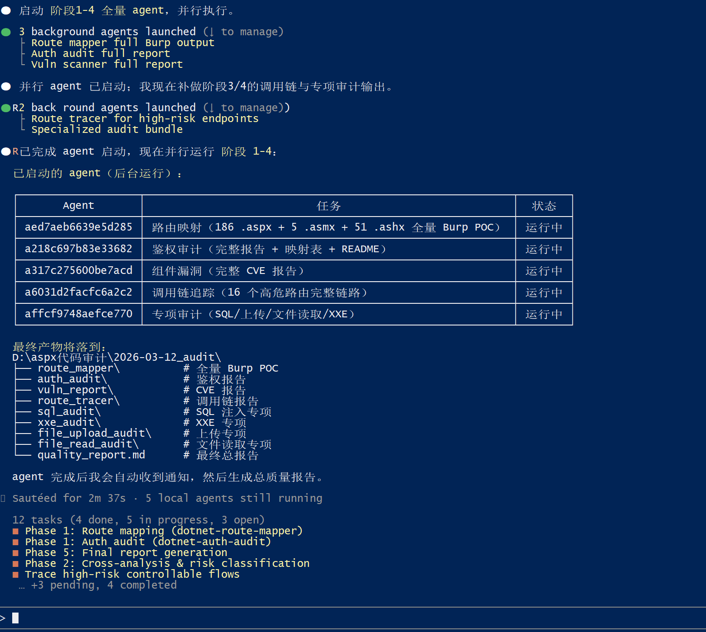
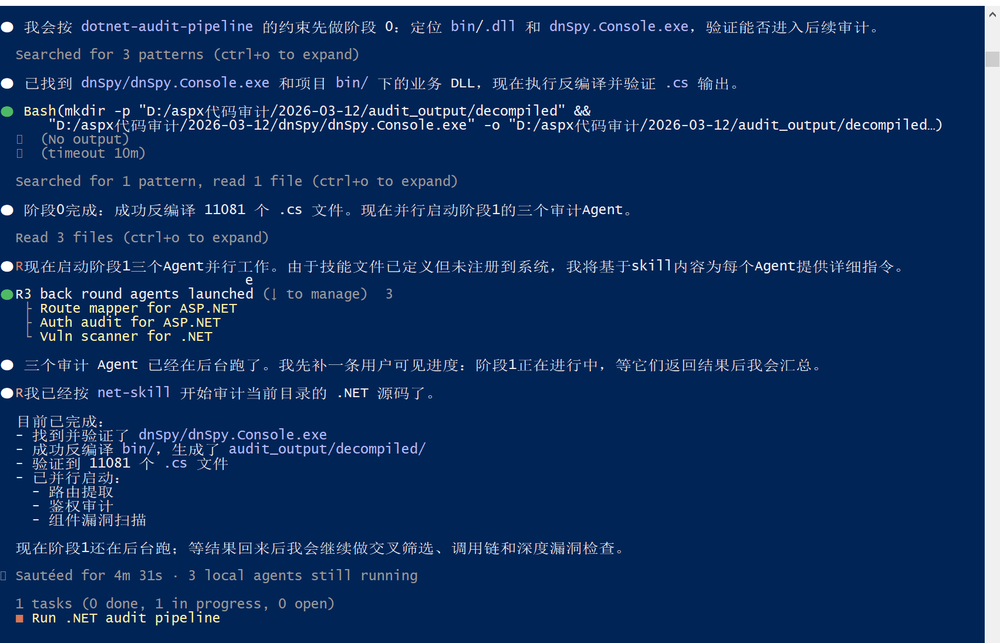
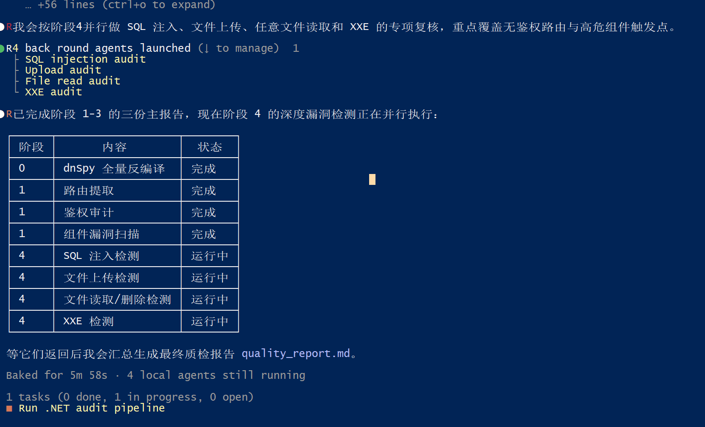
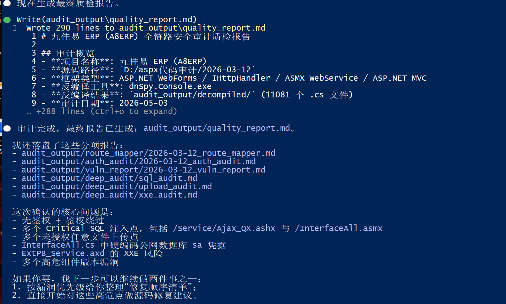

# Jing Shifu .NET Offensive Security Code Audit Skill

`net-skill` is a comprehensive security audit skill suite for .NET Web / IIS / WCF / decompilation projects. It uses [dotnet-offsec-audit](net-skill/dotnet-offsec-audit/SKILL.md) as the master orchestrator and [dotnet-audit-pipeline](net-skill/dotnet-audit-pipeline/SKILL.md) as the pipeline engine, covering routing, authentication, component vulnerabilities, call-chain tracing, and 9 categories of specialized vulnerability audits, ultimately producing a single, reviewable, safe-by-default `quality_report.md`.

**Scope:**

- ASP.NET WebForms, MVC, Web API, ASP.NET Core, WCF, IIS deployment packages.
- Source code projects, `bin/` or DLL/EXE-only projects, dnSpy decompilation results.
- Authorized source code audits, defensive hardening reviews, red team lab validations.

**Security Boundary:**

- Reports output only safe verification evidence and remediation suggestions by default.
- Content involving command execution, deserialization, SSRF, credential forgery, and ViewState/machineKey must comply with [REDTEAM_LAB_BOUNDARY.md](net-skill/shared/REDTEAM_LAB_BOUNDARY.md).
- Do not generate weaponized payloads, full keys, tokens, connection strings, or forgeable identity materials for unauthorized targets by default.

## Core Capabilities

| Capability | Coverage | Entry Skill |
|:-----|:---------|:----------|
| Master Orchestrator | Authorization boundaries, decompilation, attack surface indexing, specialized dispatch, final report | [dotnet-offsec-audit](net-skill/dotnet-offsec-audit/SKILL.md) |
| Full Pipeline | Agent phased execution, quality gates, single `quality_report.md` | [dotnet-audit-pipeline](net-skill/dotnet-audit-pipeline/SKILL.md) |
| Routing & Parameters | MVC/Web API/Core/WebForms/WCF routes, parameter sources, request templates | [dotnet-route-mapper](net-skill/dotnet-route-mapper/SKILL.md) |
| Authentication & Authorization | FormsAuth, Identity, JWT, OAuth/OIDC, Windows Auth, Membership, IDOR | [dotnet-auth-audit](net-skill/dotnet-auth-audit/SKILL.md) |
| Call-Chain Tracing | From Controller/Page/Handler/WCF to SQL, file, XML, command, etc. | [dotnet-route-tracer](net-skill/dotnet-route-tracer/SKILL.md) |
| Component Vulnerabilities | NuGet, DLL, configuration dependencies and CVE/GHSA trigger conditions | [dotnet-vuln-scanner](net-skill/dotnet-vuln-scanner/SKILL.md) |
| SQL Injection | ADO.NET, Entity Framework, Dapper, NHibernate, dynamic SQL | [dotnet-sql-audit](net-skill/dotnet-sql-audit/SKILL.md) |
| XXE/XML | XmlDocument, XmlReader, XDocument, XmlSerializer, XSLT, SOAP/OOXML/SVG | [dotnet-xxe-audit](net-skill/dotnet-xxe-audit/SKILL.md) |
| File Upload | HttpPostedFile, IFormFile, SaveAs, CopyToAsync, path and type validation | [dotnet-file-upload-audit](net-skill/dotnet-file-upload-audit/SKILL.md) |
| File Read | File.ReadAllText, FileStream, StreamReader, Response.WriteFile, path traversal | [dotnet-file-read-audit](net-skill/dotnet-file-read-audit/SKILL.md) |
| Deserialization | 11 formatters, Json.NET TypeNameHandling, ViewState/machineKey, Remoting, type control | [dotnet-deserialization-audit](net-skill/dotnet-deserialization-audit/SKILL.md) |
| Command / Dynamic Code Execution | Process.Start, ProcessStartInfo, PowerShell, CodeDom, Roslyn, XAML/XSLT, Assembly.Load | [dotnet-command-exec-audit](net-skill/dotnet-command-exec-audit/SKILL.md) |
| SSRF | HttpClient, WebRequest, URL parser, redirect, DNS rebinding, metadata, proxy headers | [dotnet-ssrf-audit](net-skill/dotnet-ssrf-audit/SKILL.md) |
| Configuration Secrets | machineKey, connection strings, JWT/OAuth/SAML secrets, certs, IIS/Swagger/ELMAH/Hangfire | [dotnet-config-secrets-audit](net-skill/dotnet-config-secrets-audit/SKILL.md) |
| Web Risk | Razor/WebForms XSS, CSRF/SameSite, CORS, Host Header, Open Redirect, IDOR/BOLA/BFLA | [dotnet-web-risk-audit](net-skill/dotnet-web-risk-audit/SKILL.md) |
| Minimal API | MapGet/MapPost, EndpointFilter, Source Generator, OpenAPI | [dotnet-minimal-api-audit](net-skill/dotnet-minimal-api-audit/SKILL.md) |
| Blazor | IJSRuntime, MarkupString, Circuit, AuthenticationStateProvider | [dotnet-blazor-audit](net-skill/dotnet-blazor-audit/SKILL.md) |
| SignalR | Hub, HubContext, Group, Message broadcast, WebSocket | [dotnet-signalr-audit](net-skill/dotnet-signalr-audit/SKILL.md) |

Full skill index: [net-skill/README.md](net-skill/README.md).

## Recommended Execution Flow

```text
Phase 0: Authorization boundary + source/deployment package identification + dnSpy decompilation
Phase 1: collect_dotnet_surface.py generates surface_index.json and attack_surface_matrix.md
Phase 2: route-mapper + auth-audit + vuln-scanner
Phase 3: High-risk route grading + specialized attack surface aggregation
Phase 4: route-tracer call-chain tracing
Phase 5: Specialized audits (SQL / XXE / File / Deserialization / Command Exec / SSRF / Secrets / Web Risk / Minimal API / Blazor / SignalR)
Phase 6: Quality check + single final report quality_report.md
```

**Recommended prompt:**

```text
Use the net-skill dotnet-offsec-audit and dotnet-audit-pipeline in the current directory
to audit the current .NET project within the authorized scope. If the source is incomplete,
decompile first with output directory ./audit-output. Generate only one quality_report.md,
using safe verification by default. Mask all secrets and tokens.
```

## Attack Surface Indexer

Built-in master skill script:

```powershell
python net-skill\dotnet-offsec-audit\scripts\collect_dotnet_surface.py <source_path> -o <output_path>\surface
```

Outputs:

- `surface_index.json`: Machine-readable attack surface index.
- `attack_surface_matrix.md`: Human review matrix.

Each finding in `surface_index.json` includes:

| Field | Description |
|:-----|:-----|
| `category` | route / auth / sql / xxe / file-read / file-upload / deserialization / command-exec / ssrf / config-secret / web-risk / minimal-api / blazor / signalr |
| `rule_id` | Matched rule identifier |
| `severity_hint` | Static risk hint, not final rating |
| `recommended_skill` | Recommended follow-up skill |
| `confidence` | High / Medium / Low |
| `evidence_kind` | sink, config, type-control, proxy-header, route-declaration, etc. |
| `file` / `line` / `snippet` | Evidence location and minimal code snippet |

Key sinks covered: `BinaryFormatter`, `TypeNameHandling`, `UnsafeDeserializeMethodResponse`, `PSObject`, `MulticastDelegate`, `WindowsIdentity`, `ClaimsIdentity`, `Process.Start`, `ProcessStartInfo`, `HttpClient`, `AllowAutoRedirect`, `ForwardedHeaders`, `X-Original-URL`, `X-Rewrite-URL`, `machineKey`, `File.ReadAllText`, `IsLocalUrl`, `SameSite`, `MapGet`, `IJSRuntime`, `MarkupString`, `Hub`, etc.

## Raw Archive & Structured References

This project uses a "raw archive + structured reference" model:

- 11 .NET deserialization lessons archived in [raw/deserialization](net-skill/dotnet-deserialization-audit/references/raw/deserialization), indexed at [RAW_REFERENCE_INDEX.md](net-skill/dotnet-deserialization-audit/references/RAW_REFERENCE_INDEX.md).
- `hack-skills` archived in [raw/hack-skills](net-skill/dotnet-offsec-audit/references/raw/hack-skills), indexed at [RAW_REFERENCE_INDEX.md](net-skill/dotnet-offsec-audit/references/RAW_REFERENCE_INDEX.md).
- Raw files are for traceability only; default audits prioritize structured references. Do not copy raw attack examples directly into the final report.

Current archive scale:

| Source | Count | Purpose |
|:-----|----:|:-----|
| .NET Deserialization 11 Lessons | 11 lessons | Formatter, trigger conditions, audit keys, remediation traceability |
| hack-skills | 18 skill families / 29 MDs | Web offensive methods, bypass conditions, chain risk traceability |

## dnSpy Decompilation Setup

When source is incomplete or only `.dll/.exe` is available, use dnSpy.Console.exe for decompilation.

**Download dnSpy (not included in repo):**

```powershell
# Run the setup script to download dnSpy automatically
.\tools\setup-dnspy.ps1
```

Or download manually from: https://github.com/dnSpy/dnSpy/releases

**Recommended directory layout:**

```text
target-project/
├── dnSpy/
│   ├── dnSpy.Console.exe
│   └── dependencies
├── bin/
└── net-skill/
```

**Example command:**

```powershell
dnSpy\dnSpy.Console.exe -o audit-output\decompiled -r bin\
```

Constraints:

- On success: verify `.cs` files exist in `decompiled/`.
- On partial failure: log failed DLLs and continue auditing decompiled + source parts.
- On missing tool: report as blocker; do not fabricate decompilation conclusions.

## Installation & Usage

**Method 1:** Copy the entire `net-skill/` directory into an agent workspace that supports local skills, then explicitly request usage.

**Method 2:** Place `net-skill/` in the root of the project to be audited, then prompt:

```text
Use the net-skill in the current directory to perform an authorized code audit
on the current .NET source. Run the dotnet-offsec-audit attack surface indexer first,
then follow dotnet-audit-pipeline to output quality_report.md.
```

## Final Report Requirements

Final deliverable: `{output_path}/quality_report.md`. Template reference: [REPORT_TEMPLATE.md](net-skill/dotnet-offsec-audit/references/REPORT_TEMPLATE.md).

Must include:

- Audit overview, authorization boundary, framework identification, decompilation scope.
- Attack surface summary, routing & auth status, P0/P1 high-risk targets.
- For each vulnerability: entry route, parameter source, call chain, sink, code evidence, evidence tag, risk rating, impact, and remediation.
- Safe verification for each high-risk issue, or explanation why safe verification is impossible.
- 11-class formatter coverage status.
- Desensitized secret display and key rotation recommendations.
- Quality coverage, raw source header integrity, security output check.

Forbidden:

- Unreplaced `TODO`, `...`, `[Fill in]`.
- Omitted outputs like "same as above", "omitted", "refer to previous".
- Full keys, tokens, connection strings.
- Default output of weaponized payloads for unauthorized targets.

## Quality Validation

Before maintenance or release, run:

```powershell
$validator = "C:\Users\user\.codex\skills\.system\skill-creator\scripts\quick_validate.py"
Get-ChildItem .\net-skill -Directory |
  Where-Object { Test-Path (Join-Path $_.FullName "SKILL.md") } |
  ForEach-Object { python $validator $_.FullName }

python -m py_compile .\net-skill\dotnet-offsec-audit\scripts\collect_dotnet_surface.py
python -m py_compile .\net-skill\dotnet-vuln-scanner\scripts\scan_dotnet_dependencies.py
```

Also check:

- Structured Markdown links are not broken; raw archives only check file existence and source headers.
- `surface_index.json` fields are complete: `recommended_skill`, `confidence`, `evidence_kind`.
- Key term coverage: 11 formatters, command exec sinks, SSRF bypass, web risks, config secrets, Minimal API, Blazor, SignalR.
- `quality_report.md` template is unique, complete, safe-by-default, with secrets redacted.

## Maintenance Sync Rules

When adding or modifying a skill, synchronize the following:

1. Corresponding `net-skill/<skill-name>/SKILL.md`.
2. Corresponding `references/` structured documents.
3. [DOTNET_ATTACK_SURFACE_TAXONOMY.md](net-skill/shared/DOTNET_ATTACK_SURFACE_TAXONOMY.md).
4. [collect_dotnet_surface.py](net-skill/dotnet-offsec-audit/scripts/collect_dotnet_surface.py) rules and recommended_skill fields.
5. [dotnet-audit-pipeline/SKILL.md](net-skill/dotnet-audit-pipeline/SKILL.md) and quality templates.
6. This README and [net-skill/README.md](net-skill/README.md).

## Support Matrix

| Framework | Status |
|-----------|--------|
| ASP.NET WebForms | ✅ Full |
| ASP.NET MVC 5 | ✅ Full |
| ASP.NET Web API 2 | ✅ Full |
| ASP.NET Core (2.x–9.x) | ✅ Full |
| WCF | ✅ Full |
| IIS Deployment Packages | ✅ Full |
| Blazor Server / WASM | ✅ v2.0 |
| SignalR | ✅ v2.0 |
| Minimal API | ✅ v2.0 |
| gRPC (.NET) | 🚧 Partial |

## Screenshots






## License

[Mulan PSL v2](LICENSE)
